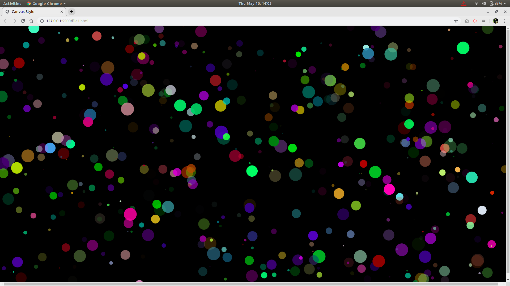
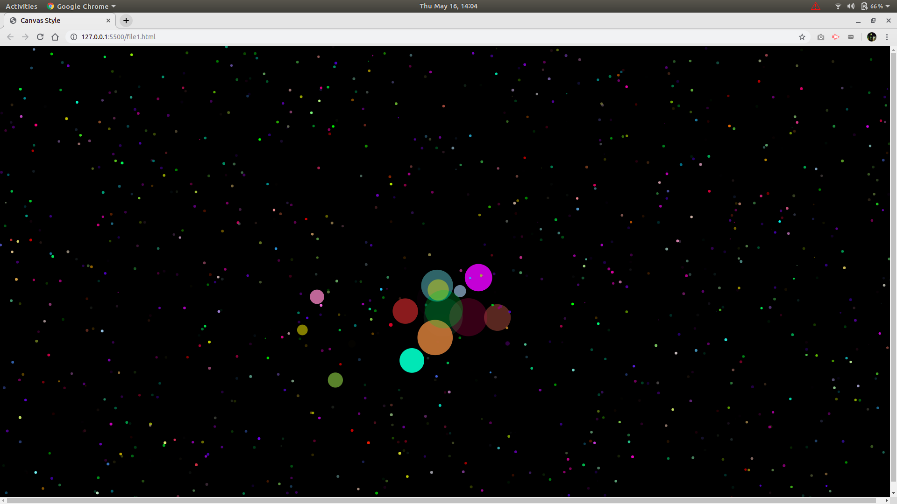

<h1>HTMLCanvas</h1>

HTML canvas is a wonderful tool for a cool elements in the web page.
It gives your work an edge over all other static sites and there's numerous ways you can create your own items as per your creativity.

HTML <b>canvas</b> elements are widely used in backgrounds to produce an excellent visual effects

Licensed under [MIT License](LICENSE).
